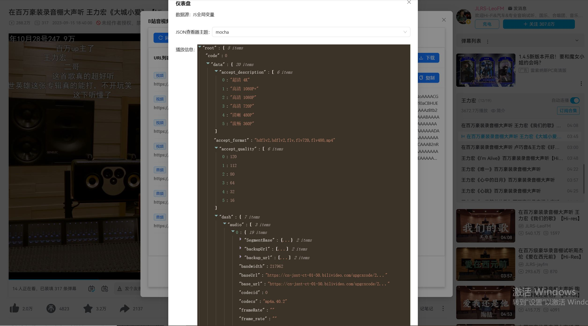
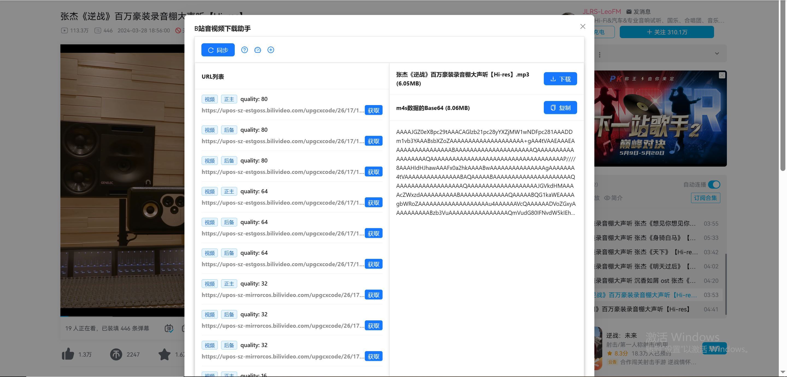
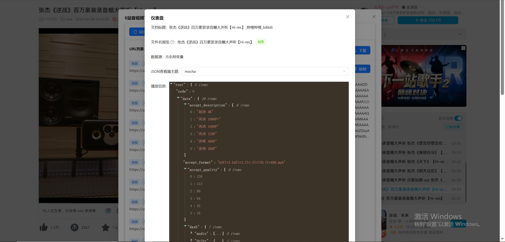
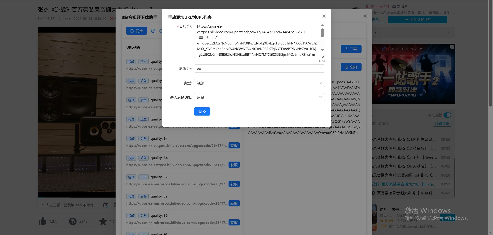

[TOC]

# 【Chrome插件开发】某视频网站的m4s音视频下载方案，及其Chrome插件实现-v250415

## 引言

Sample URL：aHR0cHM6Ly93d3cuYmlsaWJpbGkuY29tL3ZpZGVvL0JWMXBwNDIxZDc1cQ==

我去年写了这篇文章：[【前端甜点】某视频网站的m4s视频/音频下载方案（20240420）](https://www.52pojie.cn/thread-1915933-1-1.html)，但大概从去年8月开始，我发现，下载质量较高的音频时会报错`net::ERR_FAILED 206`，较低的则不报错。我百思不得其解，只能暂且猜测：

1. 该网站发现了xhr请求和fetch api发的请求的差异，导致失败。
2. 跨域问题。

但在某次尝试中，我`copy as fetch`，重放请求，发现虽然报错，但这个错误似乎可以解决：

```
<详情页url>:1 Access to fetch at '<m4s url>' from origin 'https://www.example.com' has been blocked by CORS policy: Request header field pragma is not allowed by Access-Control-Allow-Headers in preflight response.
```

做法很简单，报错提到什么字段，我就删什么字段，比如根据上面的报错，我们要删“pragma”。如此反复做几次，就能得到可以成功下载的fetch代码。据此，我新写了一版代码：

```js
// https://www.cnblogs.com/Sherries/p/14840404.html
function blobToDataURI(blob) {
  return new Promise((res, rej) => {
    const reader = new FileReader();
    reader.readAsDataURL(blob);
    reader.onload = (e) => {
      res(e.target.result);
    };
    reader.onerror = () => {
      rej(new Error('文件流异常'));
    };
  });
}

function sendFetchReq(url, rangeStart = 0) {
  return fetch(url, {
    headers: {
      'accept': '*/*',
      'accept-language': 'zh-CN,zh;q=0.9',
      'range': `bytes=${rangeStart}-`,
      // This header is unnecessary. 'sec-ch-ua': '"Chromium";v="134", "Not:A-Brand";v="24", "Google Chrome";v="134"',
      'sec-ch-ua-mobile': '?0',
      'sec-ch-ua-platform': '"Windows"',
      'sec-fetch-dest': 'empty',
      'sec-fetch-mode': 'cors',
      'sec-fetch-site': 'cross-site'
    },
    referrerPolicy: 'no-referrer-when-downgrade',
    body: null,
    method: 'GET',
    mode: 'cors',
    credentials: 'omit'
  }).then(res => res.blob());
}

async function downloader(url, rangeStart = 0) {
  const blob = await sendFetchReq(url, rangeStart);
  console.log(blob); // type is Blob
  const dataURI = await blobToDataURI(blob);
  // data:application/octet-stream;base64,
  const rawBase64Str = String(dataURI);
  const base64Str = rawBase64Str.substring(rawBase64Str.indexOf('base64,') + 7);
  console.log(rawBase64Str.substring(0, 100));
  console.log(base64Str); // 之后在浏览器控制台复制字符串，粘贴到 base64_str_m4s.txt
}

downloader('<m4s file url>');
```

其他函数不变，`sendXhrReq`改成`sendFetchReq`，将原本的`XMLHttpRequest`改成现在的`fetch API`。很轻松就跑通了。

写完这段代码后一段时间，我刷到了[码农高天的视频](https://www.bilibili.com/video/BV18oQXYKEj3)。我想，现在LLM已经很厉害了，不妨让AI辅助我，根据这段代码，快速生成一个Chrome插件。

[项目GitHub传送门](https://github.com/Hans774882968/bili-m4s-fetch-demo)

本文52pojie：https://www.52pojie.cn/thread-2026417-1-1.html

本文CSDN：https://blog.csdn.net/hans774882968/article/details/147429322

本文juejin：https://juejin.cn/post/7496003348198588470

**作者：[hans774882968](https://blog.csdn.net/hans774882968)以及[hans774882968](https://juejin.cn/user/1464964842528888)以及[hans774882968](https://www.52pojie.cn/home.php?mod=space&uid=1906177)**

## 效果

### v1.0.0

https://github.com/Hans774882968/bili-m4s-fetch-demo/releases/tag/v1.0.0


### v1.0.0-beta

https://github.com/Hans774882968/bili-m4s-fetch-demo/releases/tag/v1.0.0-beta

主界面：


仪表盘：



### v1.0.1

https://github.com/Hans774882968/bili-m4s-fetch-demo/releases/tag/v1.0.1

主界面：



仪表盘：



添加URL到URL列表：



## 项目主要技术亮点

目前主要是AI生成的，我微调一下。

1. **Chrome插件开发**
    - 使用Manifest V3规范，涉及`content.js`、`background.js`和`popup.js`的分层架构。
    - 通过`chrome.contextMenus`实现右键菜单功能，结合`documentUrlPatterns`限制菜单显示范围。
    - 跨层通信（如`chrome.runtime.onMessage`）和动态注入React组件到页面。
2. **请求处理与跨域问题**
    - 使用`fetch API`下载音视频文件，通过调整请求头（如根据报错信息多次删除`pragma`）解决CORS问题。
    - 分块下载（`range`请求）和进度监控（通过`reader.read()`实现）。
3. **前端工程化**
    - **Vite**：作为构建工具，配置`rollupOptions`优化打包（如固定文件名、多入口处理）。
    - **React 18**：结合`react-dom`动态挂载组件，使用Hooks（如`useState`、`useEffect`）管理状态。
    - **Polyfill**：通过`vite-plugin-node-polyfills`解决Node模块（如`process`、`path`）在浏览器端的兼容性问题。
4. **数据处理与解析**
    - **Babel AST**：解析网页中的JS代码（如`window.__playinfo__`），提取音视频URL。
    - **JSON处理**：动态解析接口响应，区分免费/VIP资源的多种数据结构（如`dash`和`durls`）。
5. **UI与交互优化**
    - **Ant Design**：使用组件库实现弹窗、表格、进度条等UI。
    - **文本截断**：通过`clamp-js-main`实现多行文本省略。
    - **文件下载**：基于`Blob`和`URL.createObjectURL`实现前端文件下载。
6. **调试与测试**
    - **Mock数据**：利用Vite自定义插件（`transformIndexHtml`钩子）动态注入测试用例。
    - **单元测试**：使用`vitest`进行测试，模拟日期和API请求。
7. **性能优化**
    - 避免长字符串渲染卡顿，如截断Base64展示，**用户思维**主导的文本截断可规避DOM渲染的卡顿问题。
    - 按需加载依赖（如避免引入未使用的Lodash功能）。
8. **逆向分析**
    - 通过抓包分析网站API（如`/x/player/wbi/playurl`），处理不同页面（视频、番剧、课程）的数据源差异。
9. **工具链**
    - **ESLint**：配置全局变量（如`chrome`、`__dirname`）的语法检查。
    - **Rollup插件**：如`rollup-plugin-copy`复制静态资源，`rollup-plugin-visualizer`分析打包体积。

这些技术点共同支撑了一个功能完善的音视频下载插件，覆盖了从网络请求到UI交互的全链路开发。

## 250425更新：网站逆向分析

v1.0.0的版本只考虑了视频详情页的情况，所以只解析了`window.__playinfo__`。但后来发现：

1. 番剧页面的对应变量是虽然一样，但值是从另一个变量`playurlSSRData`来的。
2. 课程视频URL没有对应的全局变量来源，只能请求接口拿。

所以还是要研究一下获取视频URL的API。参考了：

1. aHR0cHM6Ly9naXRodWIuY29tLzdyaWtrYS9iaWxpYmlsaS1hcGktZG9jcy9ibG9iL21haW4vdmlkZW8vcGxheXVybF93ZWIubWQ= 部分参数的含义
2. aHR0cHM6Ly9zb2NpYWxzaXN0ZXJ5aS5naXRodWIuaW8vYmlsaWJpbGktQVBJLWNvbGxlY3QvZG9jcy9iYW5ndW1pL3ZpZGVvc3RyZWFtX3VybC5odG1s 非必要参数决定都不填

视频详情页获取接口示例：

- https://api.example.com/x/player/wbi/playurl?avid=637650245&bvid=BV1jY4y1q7Jj&cid=559991568&qn=80&fnver=0&fnval=4048&fourk=1&gaia_source=&from_client=BROWSER&is_main_page=true&need_fragment=false&isGaiaAvoided=false&voice_balance=1

`avid`和`bvid`不需要都给出，只需要给其中一个。

番剧获取接口示例：

Sample URL：aHR0cHM6Ly93d3cuYmlsaWJpbGkuY29tL2Jhbmd1bWkvcGxheS9lcDE1MjI2MDY=

- 限免：https://api.example.com/pgc/player/web/v2/playurl?qn=80&fnver=0&fnval=4048&fourk=1&gaia_source=&from_client=BROWSER&is_main_page=true&need_fragment=true&season_id=91305&isGaiaAvoided=false&ep_id=1522604&voice_balance=1&drm_tech_type=2
- 会员：https://api.example.com/pgc/player/web/v2/playurl?qn=80&fnver=0&fnval=4048&fourk=1&gaia_source=&from_client=BROWSER&is_main_page=true&need_fragment=true&season_id=91305&isGaiaAvoided=false&ep_id=1522606&voice_balance=1&drm_tech_type=2

由season_id和ep_id共同确定。

课程视频获取接口示例：

Sample URL：aHR0cHM6Ly93d3cuYmlsaWJpbGkuY29tL2NoZWVzZS9wbGF5L2VwNzEyMDA3

- https://api.example.com/pugv/player/web/playurl?avid=1354915358&cid=1556563947&qn=80&fnver=0&fnval=16&fourk=1&gaia_source=&from_client=BROWSER&is_main_page=true&need_fragment=false&season_id=20821&isGaiaAvoided=false&ep_id=712007&voice_balance=1&drm_tech_type=2
- https://api.example.com/pugv/player/web/playurl?avid=1655481714&cid=1572480241&qn=80&fnver=0&fnval=16&fourk=1&gaia_source=&from_client=BROWSER&is_main_page=true&need_fragment=false&season_id=20821&isGaiaAvoided=false&ep_id=712012&voice_balance=1&drm_tech_type=2

同上，由`season_id`和`ep_id`共同确定。综上：

1. 虽然都有参数`session`，看上去是哈希值，但实测可去掉。这意味着可以直接请求接口了。
2. 视频详情页主要是需要`avid/bvid`其一和`cid`，番剧和课程视频主要是需要`avid/bvid`其一、`cid, season_id, ep_id`，都可以在HTML里拿到。其他的参数暂且可以写死。

但课程页面的视频有两种情况：

1. 如果URL给的是`/ep114514`这种形式，就需要请求另一个接口才能拿到`aid, cid, season_id`：https://api.example.com/pugv/view/web/season?ep_id=712008&isGaiaAvoided=false 取`data.episodes`数组。
2. 如果URL给的是`/ss20821`这种形式，可以直接在全局变量`window.__EduPlayPiniaState__`拿到。但实测上一行的接口直接换成`season_id=20821`，也能拿到数据。

关于请求响应体：经过粗略观察可知，可以分为5种情况：视频详情页、免费番剧、VIP番剧、免费课程、VIP课程。免费的会分为`audio`的m4s数组和`video`的m4s数组；VIP的则只会给出`durls`的mp4数组。对于**所有的免费场景和所有的VIP场景，数组的数据结构都大同小异**，暂时可以用同一套代码。虽然视频详情页没有VIP的情况，但我们为了代码架构设计方便，**不妨假设视频详情页也有VIP的情况**。于是我决定，实现一个基类`class PlayInfoParser`和三个子类，每个子类内部自己处理好免费和VIP两种情况的JSON数据。

综上，我决定，在视频详情页和番剧页面，通过读全局变量拿视频URL；在课程页面，两种情况都通过请求两个API拿视频URL（后续可以升级，让`/ss20821`的情况省一个请求）。另外，要提供一个表单，允许用户抓包拿到视频URL后将其添加进我们插件的URL列表。

TODO: 课程页面`/ss20821`的场景，如何拿到用户的观看进度数据？我已经找到相关API，但不知道为什么，重放请求失败。

## 让AI写初稿

[最初的Prompt传送门](https://www.doubao.com/chat/2753124001160962)：

> 请帮我写一个Chrome扩展程序。要求如下：
>
> 1. 使用manifest v3，只在 https://www.example.com/ 激活。
> 2. 请生成前端工程，使用React 18和Yarn，组件库用ant-design。
> 3. 为鼠标右键添加一个选项，点击产生一个弹窗。弹窗由两个div组成，分别占据弹窗的左侧和右侧。左侧和右侧div的class名分别为“url-list”和“result”，下文分别用url-list和div.result指代。这两个div的width和height都应一样。url-list是一个列表，每个条目展示一个url，每个条目的右侧都有一个按钮，文案为“获取”。div.result展示一个base64字符串，文本过长则用省略号省略过长部分，并提供一个按钮，文案为“复制”，点击后将字符串复制到剪贴板。
> 4. 监听网络请求，如果某请求的url包含字符串30216.m4s、30232.m4s、30264.m4s、30280.m4s中的一个，则将该url添加到url-list中展示，注意它要添加到url-list的开头，使得最新的请求排在最前面。点击某url右侧“获取”按钮，则向该url发送get请求，将返回体转为blob，进而编码为base64字符串，展示在div.result中。
> 5.  url-list提供分页功能，每页展示10个条目。
>
> 生成的代码有很多问题，比如不是React脚手架生成的、没有package.json等。所以有了后续的Chat：
>
> - 该react项目应使用vite脚手架生成
> - 请提供package.json

写README的时候再回顾这段Prompt，感觉可能是我脑海里的需求点太过模糊，也可能是我对Chrome插件的API不够熟悉，才导致了AI生成的代码离勉强可用成品都有很大的鸿沟。当然，它还是给了我一点点启发。

## 两条路：在`content.js`里，还是`popup.js`里发请求？

我们知道Chrome插件分为3层，分别为`content.js`、`background.js`和`popup.html / popup.js`。`content.js`注入某个标签页中运行，`background.js`是插件的后台程序，`popup.js`则可以弹出一个网页。所以理论上，我们可以在`content.js`中或`popup.js`中发请求。前者的流程图（[参考链接3](https://stackoverflow.com/questions/12265403/passing-message-from-background-js-to-popup-js)）：


后者的流程图：


前者需要让数据从`content.js`，流到`background.js`，再到`popup.js`。后者需要我们用纯JS弹出一个窗口，作为插件的UI。那选哪条路呢？理论上，两条路都是OK的，只是实现的难点略有差异。

但实际上，经过我亲自开发踩坑，因为该网站有请求头校验，而fetch API无法修改请求头的Origin，所以在`popup.js`中发请求的方案是不可行的。因为也浪费了些精力，所以我仍然把该方案的代码留了下来，放在`bili-m4s-fetch-demo-deprecated`文件夹。我会在我的下一篇blog（TODO: Chrome插件实现PPT编辑）中简单讲下其难点。

## World in `content.js`

### 新建项目

```powershell
yarn create vite bili-m4s-fetch-demo
```

即可新建Vite + React项目。因为我感觉这只是一个袖珍项目，所以并没有为项目引入TypeScript。

项目结构：

```
.
│  .gitignore
│  background.js
│  eslint.config.js
│  index.html
│  manifest.json
│  package.json
│  README.md
│  vite.config.js
│  
├─bili-m4s-fetch-demo-deprecated
│  │  省略
│          
├─public
│      favicon.ico
│      
├─README_assets
│      1-example-v1.0.0.jpg
│      2-3-layers.mmd
│      2-3-layers.png
│      3-world-in-content.mmd
│      3-world-in-content.png
│      
└─src
    │  App.jsx
    │  App.scss
    │  content.js
    │  main.jsx
    │  
    ├─clamp-js
    │      HansClamp.jsx
    │      
    ├─common
    │      downloadFile.js
    │      getUrlsFromExampleCom.js
    │      M4sUrlDesc.js
    │      request.js
    │      utils.js
    │      
    └─images
            bili.png
```

### 如何打包

[代码传送门](https://github.com/Hans774882968/bili-m4s-fetch-demo/blob/main/vite.config.js)

`manifest.json`等文件，需要复制到dist文件夹，可用`rollup-plugin-copy`实现。

为了方便调试，我们希望`content.js`能在开发环境模拟生产环境注入某标签页的场景，因此我们约定入口为`index.html`，相应地，该html要在vite给的初始html的基础上改一下。在生产环境，入口显然为`content.js`。问deepseek可知，`defineConfig`提供了`mode`参数判断是什么环境，而在`content.js`中，可用`const isDev = import.meta.env.MODE === 'development';`判断。

另外，问deepseek可知，需要`build.rollupOptions.output.entryFileNames: '[name].js'`，让产物JS文件名没有hash。deepseek还很贴心地给了张对比表：

| 配置项         | 默认行为                             | 我们需要的行为             |
| -------------- | ------------------------------------ | -------------------------- |
| input          | 从 index.html 开始打包               | 直接从 content.js 开始打包 |
| entryFileNames | 带 hash 的文件名 (content.[hash].js) | 固定文件名 (content.js)    |
| chunkFileNames | 带 hash 的 chunk 名                  | 固定 chunk 名              |

相关Prompt：

1. 打包框架是vite，这是一个vite脚手架生成的react项目。我希望修改vite.config.js，以content.js为打包入口，去掉没必要存在的index.html，且打包后对应的js文件名仍为content.js。请根据以上信息修改上述代码。
2. 请调整vite.config.js及其他文件，实现：在开发模式下，入口为content.html，引用content.js；在生产模式下，和原来一样，入口为content.js

### `background.js`：在鼠标右键菜单添加一个选项，点击后通知`content.js`第一次创建弹窗

问AI即可拿到可用的代码：

```js
const MENU_ITEM_ID = 'bili-m4s-fetch-demo';

chrome.runtime.onInstalled.addListener(() => {
  chrome.contextMenus.create({
    id: MENU_ITEM_ID,
    title: 'Bili M4S Fetch Demo',
  });
});

chrome.contextMenus.onClicked.addListener((info, tab) => {
  if (info.menuItemId === MENU_ITEM_ID && tab.id) {
    chrome.tabs.sendMessage(tab.id, { type: 'openDownloaderDialog' });
  }
});

console.log(`[${MENU_ITEM_ID}] background.js loaded`);
```

但有个无伤大雅的问题：在其他网站仍然会出现该选项，点击后却没有反应。从交互的角度来说，在其他网站，要么不展示它，要么点击后弹出提示。于是我[问AI要代码](https://chat.deepseek.com/a/chat/s/b20cb2c9-e050-4b81-9fcd-132d8bf57be9)：

> 请修改background.js，实现：只有当前标签页url在manifest.json中host_permissions指定的url列表中时，才为右键菜单添加选项

我在AI给的代码的基础上改了一点点：

```js
const MENU_ITEM_ID = 'bili-m4s-fetch-demo';

let menuItemCreated = false;

// 检查URL是否匹配host_permissions
function isUrlInHostPermissions(url) {
  if (!url) return false;

  try {
    const allowedPatterns = [
      'https://www.example.com/*'
    ];

    return allowedPatterns.some((pattern) => {
      const regex = new RegExp(pattern
        .replace(/\./g, '\\.')
        .replace(/\*/g, '.*'));
      return regex.test(url);
    });
  } catch (error) {
    console.error('URL检查出错:', error);
    return false;
  }
}

// 维护状态机：创建或移除右键菜单
async function updateContextMenu(tabId) {
  try {
    const tab = await chrome.tabs.get(tabId);
    const urlAllowed = isUrlInHostPermissions(tab.url);
    // AI 代码的 bug ： menuItemCreated 是互斥锁，需要在耗时操作之前就上锁，耗时操作之后再解锁，否则会有并发问题
    if (urlAllowed && !menuItemCreated) {
      menuItemCreated = true;
      chrome.contextMenus.create({
        id: MENU_ITEM_ID,
        title: 'Bili M4S Fetch Demo',
      });
    } else if (!urlAllowed && menuItemCreated) {
      // AI 没发现的区别：创建菜单不会返回 Promise ，移除菜单则会，所以记得加 await
      await chrome.contextMenus.remove(MENU_ITEM_ID);
      menuItemCreated = false;
    }
  } catch (error) {
    console.error('更新右键菜单出错:', error);
  }
}

// 监听标签页更新
chrome.tabs.onUpdated.addListener((tabId, changeInfo) => {
  if (changeInfo.url || changeInfo.status === 'complete') {
    updateContextMenu(tabId);
  }
});

// 监听标签页切换
chrome.tabs.onActivated.addListener((activeInfo) => {
  updateContextMenu(activeInfo.tabId);
});

chrome.runtime.onInstalled.addListener(async () => {
  const [tab] = await chrome.tabs.query({ active: true, currentWindow: true });
  if (tab) {
    updateContextMenu(tab.id);
  }
});

chrome.contextMenus.onClicked.addListener((info, tab) => {
  if (info.menuItemId === MENU_ITEM_ID && tab.id) {
    chrome.tabs.sendMessage(tab.id, { type: 'openDownloaderDialog' });
  }
});

console.log(`[${MENU_ITEM_ID}] background.js loaded`);
```

生成的代码有70行，但思路很简单，就是写一个函数，维护一个状态机，在标签页切换时调用，写过算法题的同学们都很熟悉。但`chrome.contextMenus.remove()`只传了一个参数，所以返回Promise，却忘记加await，导致并发问题：有可能重复创建相同ID的菜单选项。加上await以后，发现还是有并发问题，后来我猜测是互斥锁应该要更早上锁，所以加了那行注释。因为已经采用了下文的解决方案，所以我不打算检验这段代码的正确性了。

在我一筹莫展时，查文档发现，其实Chrome已经提供了一个`documentUrlPatterns`参数来实现这个功能，哪里需要这70行代码……完整代码：

```js
const MENU_ITEM_ID = 'bili-m4s-fetch-demo';

chrome.runtime.onInstalled.addListener(() => {
  chrome.contextMenus.create({
    id: MENU_ITEM_ID,
    title: 'Bili M4S Fetch Demo',
    documentUrlPatterns: ['https://www.example.com/*']
  });
});

chrome.contextMenus.onClicked.addListener((info, tab) => {
  if (info.menuItemId === MENU_ITEM_ID && tab.id) {
    chrome.tabs.sendMessage(tab.id, { type: 'openDownloaderDialog' });
  }
});

console.log(`[${MENU_ITEM_ID}] background.js loaded`);
```

### eslint 9如何镇压`__dirname`的eslint报错

eslint 8的老配置是：`{ env: { node: true, browser: true }}`（它们并不冲突），而新版要改为：

```js
    languageOptions: {
      // https://stackoverflow.com/questions/48584556/eslint-chrome-is-not-defined-no-undef
      globals: {
        ...globals.node,
        ...globals.browser,
        ...globals.webextensions
      },
    }
```

同理，它们并不冲突。

### `content.css`：希望像普通的前端项目一样写CSS

为了能像普通的前端项目一样写CSS，我们希望让jsx import的CSS文件能被打包为`content.css`。

首先，需要修改`manifest.json`，让插件在标签页注入CSS：

```json
  "content_scripts": [
    {
      "matches": [
        "https://www.example.com/*"
      ],
      "js": [
        "content.js"
      ],
      "css": [
        "content.css"
      ]
    }
  ],
```

接着，修改打包配置：`build.rollupOptions.output.assetFileNames: '[name].[ext]'`。然后，React组件正常import CSS文件就行：`import './App.scss';`。为了使用`scss`，需要先装好`sass`包：`yarn add -D sass`。然后，其他配置都不需要了，直接写就OK。

### 让`content.js`挂载组件

参考Vite + React项目模板`main.jsx`的代码，我们不难想到，需要用`react-dom`才能做到。

```jsx
import { StrictMode } from 'react';
import { createRoot } from 'react-dom/client';
import App from './App.jsx';

let dialogRef = null;

export function renderDownloaderDialog(initialUrls = []) {
  if (dialogRef) {
    return;
  }
  const dialog = document.createElement('div');
  dialog.id = 'bili-downloader-dialog';
  dialog.style.position = 'relative'; // for expand-dialog-btn, may be unnecessary
  document.body.appendChild(dialog);
  dialogRef = dialog;
  createRoot(dialog).render(
    <StrictMode>
      <App initialUrls={initialUrls} />
    </StrictMode>,
  );
}
```

### 难点1：在万恶的manifest V3中，如何拿到音视频URL

一开始我考虑的方案非常simple非常naive：监听网络请求，匹配`30280.m4s`等。在manifest V2里，这完全OK。但现在万恶的咕果逼我们使用manifest V3，而相关资料少得可怜。

#### 被PASS的方案：onRuleMatchedDebug

于是我问doubao：

> 使用Chrome的manifest v3 declarativeNetRequest如何获取每一个网络请求的URL

得到代码：

`manifest.json`：

```json
{
    "manifest_version": 3,
    "name": "URL Catcher",
    "version": "1.0",
    "description": "Catch all network request URLs",
    "permissions": [
        "declarativeNetRequest",
        "declarativeNetRequestFeedback",
        "activeTab"
    ],
    "background": {
        "service_worker": "background.js"
    }
}
```

`background.js`：

```js
// 规则 ID
const RULE_ID = 1;

// 定义规则，匹配所有请求
const rules = [
    {
        id: RULE_ID,
        priority: 1,
        action: { type: 'allow' },
        condition: { urlFilter: '*', resourceTypes: ['main_frame', 'sub_frame', 'stylesheet', 'script', 'image', 'font', 'object', 'xmlhttprequest', 'ping', 'csp_report', 'media', 'websocket', 'webtransport', 'webbundle'] }
    }
];

// 注册规则
chrome.declarativeNetRequest.updateDynamicRules({
    removeRuleIds: [RULE_ID],
    addRules: rules
}, () => {
    console.log('Rules updated');
});

// 监听请求反馈
chrome.declarativeNetRequest.onRuleMatchedDebug.addListener(({ request, rule }) => {
    if (rule.id === RULE_ID) {
        console.log('Caught URL:', request.url);
    }
});
```

#### v1.0.0方案：解析`window.__playinfo__`

但后来我发现，该网站提供了`window.__playinfo__`，只需要解析它就行，所以我没运行代码就PASS掉了上述方案。

```js
{
    code: 0, data: { dash: {
    audio: [{ id: 30280 / 30232 / 30216, baseUrl: "", backupUrl: "" }] // 3 items
    video: [{ id: 80 / 64 / 32 / 16, baseUrl: "", backupUrl: "" }] // 4 * 3 items
    }}
}
```

但`content.js`是独立的执行环境，拿不到这个变量，所以我们需要用JS去读script标签的代码。于是继续问doubao拿代码（[getUrlsFromExampleCom.js](https://github.com/Hans774882968/bili-m4s-fetch-demo/blob/main/src/common/getUrlsFromBiliBili.js)）：

```js
function parseScriptTags(scriptTags) {
  for (const scriptTag of scriptTags) {
    const scriptContent = scriptTag.textContent;
    if (!scriptContent || !scriptContent.includes('window.__playinfo__')) continue;
    const startIndex = scriptContent.indexOf('{');
    const endIndex = scriptContent.lastIndexOf('}') + 1;
    const jsonString = scriptContent.slice(startIndex, endIndex);
    try {
      const playInfo = JSON.parse(jsonString);
      return playInfo;
    } catch (error) {
      console.error('Error parsing playInfo JSON:', error);
    }
  }
  return {};
}

export function getPlayInfoFromScriptTag() {
  if (window.__playinfo__ && typeof window.__playinfo__ === 'object') {
    return window.__playinfo__;
  }
  const scriptTags = [...document.getElementsByTagName('script')];
  return parseScriptTags(scriptTags);
}
```

因为这个script标签只有`window.__playinfo__ = {...}`这一行赋值语句，所以可以用这个很粗糙的算法去拿。数据处理的代码比较杂乱，在此只展示一点点：

```js
const isDev = import.meta.env.MODE === 'development';

export function getUrlsFromExampleCom() {
  if (isDev) {
    return [
      new M4sUrlDesc('not a url 1', 80, M4sUrlDesc.VIDEO),
      new M4sUrlDesc('not a url 2', 64, M4sUrlDesc.VIDEO),
      new M4sUrlDesc('not a url 3', 32, M4sUrlDesc.VIDEO),
      new M4sUrlDesc('not a url 4', 16, M4sUrlDesc.VIDEO),
      new M4sUrlDesc('not a url 5', 30280, M4sUrlDesc.AUDIO),
      new M4sUrlDesc('not a url 6', 30232, M4sUrlDesc.AUDIO),
      new M4sUrlDesc('not a url 7', 30216, M4sUrlDesc.AUDIO),
      new M4sUrlDesc(`this is a ${'long'.repeat(200)} url`, 114514, M4sUrlDesc.AUDIO)
    ];
  }
  const playInfo = getPlayInfoFromScriptTag();
  const urlsObj = getUrlsObjFromPlayInfo(playInfo);
  const urls = [...urlsObj.videoUrls, ...urlsObj.audioUrls];
  return urls;
}
```

接下来我们要考虑如何让组件拿到这些URL。最后我认为，因为在同一个详情页中，`window.__playinfo__`一直不变，所以渲染时把URL初值从`content.js`传进组件就OK。

```js
const isDev = import.meta.env.MODE === 'development';
const initialUrls = getUrlsFromExampleCom();
if (isDev) {
  renderDownloaderDialog(initialUrls);
} else {
  chrome.runtime.onMessage.addListener((message) => {
    if (message.type === 'openDownloaderDialog') {
      renderDownloaderDialog(initialUrls);
    }
  });
}
```

#### v1.0.0方案升级：使用Babel AST解析JS代码，增加鲁棒性

上文“250425更新：网站逆向分析”提到，番剧页面的JS代码结构和视频详情页不一样，大概是这样的：

```js
const playurlSSRData = {};
if (true) {
  window.__playinfo__ = playurlSSRData;
}
```

如果没有赋值语句，我v1.0.0版的代码不会有问题，但这里出现了，而且右侧并不是JSON数据，我的代码就会报错。为了处理这种情况，我第一个想到的，就是用我已经很熟悉的Babel来求变量的值。注意到这是一个常量折叠的问题，但我还没用过相关的包，所以我打算按[我之前的前端逆向项目](https://github.com/Hans774882968/control-flow-flattening-remove-public)的套路去实现。现在有了deepseek，写Babel解析AST的代码容易多了。相关Prompt：

>1. 请用@babel/parser、@babel/traverse、@babel/types和@babel/generator写一个函数function parsePlayInfoFromJSCode(jsCode)，实现从以下两种情况的代码中，提取`window.__playinfo__`的值，代码保证其值符合JSON对象格式。（两种情况的代码是粘贴给LLM看的，不在此展示了）
>2. 1、判断赋值表达式左侧的`window.__playinfo__`时，应使用early return。能使用early return减少嵌套的，都要减少嵌套。2、改成es module import。3、不需要使用eval，用JSON.parse即可。

令人惊讶的是，AI生成的代码几乎没逻辑问题，只是细节不太优雅。我现在不再需要像两年前那样，时时盯着astexplorer.net，而是只用它来review一下AI代码！思路很简单，分两种情况，右侧是对象字面量，对应`isObjectExpression`，右侧是变量，对应`isIdentifier`。后一种麻烦点的情况，用`const binding = path.scope.getBinding(right.name); const init = binding.path.node.init;`即可拿到`playurlSSRData`的初值。

完整代码比较长，不粘了，[传送门](https://github.com/Hans774882968/bili-m4s-fetch-demo/blob/main/src/common/parsePlayInfoFromJSCode.js)

为了测试方便，我让普通的JS对象字面量也作为输入，导致JSON.parse不足以cover。所以我又问LLM如下问题：“已知right变量是ObjectExpression。那么babel有提供相关的API，将这个ObjectExpression转为JS对象吗？”它就给我推荐了`path.evaluate()`。写法如下：

```js
const evaluated = path.get('right').evaluate();
const evaluated = binding.path.get('init').evaluate();
if (evaluated.confident) {
  playInfo = evaluated.value;
}
```

最后改造一下原有的`parseScriptTags`就OK：

```js
function parseScriptTags(scriptTags) {
  for (const scriptTag of scriptTags) {
    const scriptContent = scriptTag.textContent;
    if (!scriptContent || !scriptContent.includes('window.__playinfo__')) continue;
    const playInfo = parsePlayInfoFromJSCode(scriptContent);
    return playInfo;
  }
  return {};
}
```

### 如果在浏览器运行的代码导入了Babel相关的包，则需要polyfill

上一节导入了Babel相关的包，但Babel相关的包是跑在服务端的，所以会报错：`process is not defined`。这里的`process`就是nodejs的。问AI后确定，我们需要polyfill，用`vite-plugin-node-polyfills`实现。安装：`yarn add -D vite-plugin-node-polyfills`。vite.config.js：

```js
    plugins: [
      nodePolyfills({
        include: ['process'],
      }),
    ]
```

反复调试，在这个include里不断添加，直到控制台不报错为止。

### 难点1-250508更新：进一步使用Babel AST，应对番剧页面的更新

8号测插件的时候，我发现番剧的网页源代码的JS代码更新了，多了一种可能的返回：

```js
const playurlSSRData = {}
if (playurlSSRData && typeof playurlSSRData === 'object' && !!playurlSSRData.body && true) {
  window.__playinfo__ = playurlSSRData.raw
}
```

所以我需要写段代码兼容这种新情况。一开始我给deepseek的prompt比较模糊，如下：

>这份代码已经实现从两种情况中获取到`window.__playinfo__`的值，现在希望在此基础上新增对第三种情况的支持：`const playurlSSRData = { "raw": { "data": { "from": "local" } } }; window.__playinfo__ = playurlSSRData.raw`。这里不一定只有一层，也可以是`playurlSSRData.raw.x.y.z`之类的，任意多层。

它生成的代码确实也不能正确工作。于是我叫它按照我自己的一个很直观的思路去写代码，就得到可用的代码了。

> 该代码并未成功实现多层属性访问。resolveMemberExpression改名为resolveMemberExpressionRight。我希望你重写该方法，采用我给你的思路：首先收集右侧的属性访问数组，比如`playurlSSRData.raw.x.y.z`对应`['raw', 'x', 'y', 'z']`，然后拿到playurlSSRData的对象字面量，最后通过上述数组进行对象字面量的属性访问。

代码：

```js
export function resolveMemberExpressionRight(path, scope) {
  const propertyAccessChain = [];
  let currentPath = path;
  let baseObject = null;

  // 1. 收集属性访问链
  while (currentPath.isMemberExpression()) {
    const property = currentPath.get('property').node;

    // 获取属性名（支持标识符、字符串和数字字面量）
    let propertyName = null;
    if (isIdentifier(property)) {
      propertyName = property.name;
    } else if (isStringLiteral(property)) {
      propertyName = property.value;
    } else if (isNumericLiteral(property)) {
      propertyName = property.value;
    } else {
      return null; // 不支持的属性类型
    }

    propertyAccessChain.unshift(propertyName);
    currentPath = currentPath.get('object');
  }

  // 2. 获取基础对象
  if (currentPath.isIdentifier()) {
    const binding = scope.getBinding(currentPath.node.name);
    if (!binding) return null;
    const init = binding.path.node.init;
    if (!isObjectExpression(init)) {
      return null;
    }
    const evaluated = binding.path.get('init').evaluate();
    baseObject = getJSObjFromObjectExpression(init, evaluated);
  } else if (currentPath.isObjectExpression()) {
    const evaluated = currentPath.evaluate();
    baseObject = getJSObjFromObjectExpression(currentPath.node, evaluated);
  } else {
    return null; // 不支持的类型
  }

  // 3. 按照属性链访问对象
  let result = baseObject;
  for (const prop of propertyAccessChain) {
    if (result && typeof result === 'object' && prop in result) {
      result = result[prop];
    } else {
      return null; // 属性访问失败。实际值是 undefined 但我们返回 null
    }
  }

  return result;
}

      // Case 3: Variable assignment (member expression, nested property access)
      if (isMemberExpression(right)) {
        playInfo = resolveMemberExpressionRight(path.get('right'), path.scope);
        return;
      }
```

### 难点2：切换到其他视频详情页，该网站并不刷新，也不更新`window.__playinfo__`

这就导致我的组件拿不到最新的音视频URL。我抓包发现，它请求了`https://api.example.com/x/player/wbi/playurl`，参数很复杂，不想花精力去逆向它。然后我想到，只需要用fetch API再向网页发一次请求即可。相关代码：

```js
// 在同一个url请求，会得到301，但无伤大雅
export async function getNewPlayInfoFromHtml() {
  const resp = await fetch(window.location.href);
  const htmlStr = await resp.text();
  const parser = new DOMParser();
  const doc = parser.parseFromString(htmlStr, 'text/html');
  const scriptTags = [...doc.getElementsByTagName('script')];
  return parseScriptTags(scriptTags);
}

export async function getNewUrlsFromFetchApi() {
  const playInfo = await getNewPlayInfoFromHtml();
  const urlsObj = getUrlsObjFromPlayInfo(playInfo);
  const urls = [...urlsObj.videoUrls, ...urlsObj.audioUrls];
  return urls;
}
```

这里用到`DOMParser`，其功能和Python爬虫常用的BeautifulSoup类似。然后在UI的对话框加一个“同步”按钮，提示用户手动按按钮去拿到最新的URL。

```jsx
  const [urls, setUrls] = useState(initialUrls);

  const updateM4sUrls = async () => {
    const newUrls = await getNewUrlsFromFetchApi();
    setUrls(newUrls);
    messageApi.success('同步完成');
  };
        // 组件：
        <Header className="download-helper-toolbar">
          <Button
            type="primary"
            icon={<ReloadOutlined />}
            onClick={updateM4sUrls}
          >
            同步
          </Button>
          <Tooltip title={syncBtnTooltipTitle}>
            <QuestionCircleTwoTone style={{ fontSize: '16px' }} />
          </Tooltip>
        </Header>
```

### 难点3：用户多次点击右键菜单新增的条目，如何应对？用“用户思维”规避技术难题

一开始我考虑的方案：

1. 让对话框再次出现。`content.js`的代码在组件之外，所以这不现实。
2. 叉掉对话框时，让它被销毁，而非被隐藏。看了下控制台，对话框的DOM元素并不是`<div id="root">`的子元素。如果要强行实现这个方案，代码会比较丑。

后来我意识到，不需要在**技术层面**让组件消失，只需要在对话框隐藏期间，让组件对用户来说**不太显眼**。相应地，用户多次点击右键菜单新增条目时，我们不予理会。于是我们用**用户思维**成功规避了技术难题。但在对话框隐藏期间，我们如何唤出它？很简单，我们展示一个悬浮在网页右上角的按钮，用户点击按钮时，对话框便再次出现。

```jsx
  const [isDialogOpen, setIsDialogOpen] = useState(true);
  const expandDialog = () => {
    setIsDialogOpen(true);
  };
  const expandDialogBtn = !isDialogOpen && (
    <Button
      type="primary"
      className="expand-dialog-btn"
      style={{ position: 'fixed', zIndex: 114514, top: '80px', right: '16px' }}
      icon={<ArrowsAltOutlined />}
      onClick={expandDialog}
    >
      展开下载助手
    </Button>
  );
```

还有个小插曲。我给按钮设置了如下CSS：

```scss
.expand-dialog-btn {
  position: fixed; // 这条属性被去掉是因为antd为button指定了position: relative，所以我们为它指定同样的内联样式
  z-index: 114514;
  top: 80px;
  right: 16px;
}
```

但调试时发现，`position: fixed`这行CSS被划线了。后来发现，这是因为antd为button指定了`position: relative`，且优先级比我这行CSS高。于是我把这几行CSS都复制到了组件的内联样式中。再次运行，按钮的位置正确了。

### 常规1：提供文件下载功能

前端下载文件的JS代码，网上随处可见。原理很简单：创建a标签，设置download属性，将blob装进去。

```js
export function downloadFileByALink(blob, fileName) {
  const aLink = document.createElement('a');
  document.body.appendChild(aLink);
  aLink.style.display = 'none';
  const objectUrl = window.URL.createObjectURL(blob);
  aLink.href = objectUrl;
  aLink.download = fileName;
  aLink.click();
  document.body.removeChild(aLink);
}
```

接着在按钮点击时调用：

```js
  const handleExport = () => {
    downloadFileByALink(blobResult, m4sFileName);
  };
```

至于`blobResult`，只需要：

```js
fetch().then(res => res.blob());
```

就能拿到。

### 难点4：在React项目中实现，多行文本只展示前10行（clamp-js-main）

我不仅在界面提供了可下载的文件，还提供了可复制的文件内容的Base64字符串。于是我希望只展示前10行文本，其余的显示省略号。一开始我用了纯CSS：

```scss
.line-clamp-10 {
    display: -webkit-box;
    -webkit-box-orient: vertical;
    -webkit-line-clamp: 10;
    overflow: hidden;
}
```

这就是搜索引擎上流行的解法，但实测不生效。于是我通过一番搜索，找到了`react-dotdotdot`这个包。但运行时报错：Could not resolve "prop-types"。问了doubao，解决这个报错后，代码能跑，但控制台又有报错，说它用了React废弃的老API。所以我决定放弃这个方案。于是又问deepseek：

> 为了在Vite + React项目中实现10行以上文本显示省略号，可以使用react-dotdotdot包。但该包太古老了。有更新的替代方案吗？

看了一眼，觉得它给的3个方案都不靠谱，但我搜到一个包叫`clamp.js`，就继续问：

> 如何在react项目中使用clamp.js，实现10行以上文本显示省略号？

它就给我推荐了`yarn add clamp-js-main`。虽然看GitHub，这个包已经变只读了，但似乎能跑，我就不管那么多了。`src\clamp-js\HansClamp.jsx`：

```jsx
import { useEffect, useRef } from 'react';
import { clamp } from 'clamp-js-main';

export default function HansClamp({ text, lines, className = '' }) {
  const textRef = useRef(null);

  useEffect(() => {
    if (textRef.current) {
      clamp(textRef.current, { clamp: lines });
    }
  }, [text, lines]);

  return (
    <div ref={textRef} className={className}>
      {text}
    </div>
  );
}
```

`App.jsx`调用：

```jsx
            <Content className="sub-div-content result-content">
              <HansClamp
                lines={10}
                text={base64Result || '暂无，请先发请求'}
              />
            </Content>
```

### 常规2：过长的base64字符串引起的卡顿问题——“用户思维”又一例

我们已经做了多行文本省略功能，但文本毕竟在那里占着空间。所以当对话框由不显示变为显示时，会出现比较严重的卡顿。同样地，使用用户思维，直接把显示给用户看的字符串换成被截断的版本即可。这样就避免了一切技术难题。

```jsx
const base64ResultOnDisplay = base64Result.substring(0, 1000);

            <Content className="sub-div-content result-content">
              <HansClamp
                lines={10}
                text={base64ResultOnDisplay || '暂无，请先发请求'}
              />
            </Content>
```

### 难点5：用`transformIndexHtml`实现：开发环境下，页面每次刷新，都向index.html注入随机的JS代码，方便测试（为“难点1-v1.0.0方案升级”一节赋能）

一开始我搜到了[vite-plugin-html](https://github.com/vbenjs/vite-plugin-html)这个Vite插件，用法很简单。但发现效果不符合我的期望：我希望每次刷新都能获得随机元素，但这个插件只能实现每次重启开发服务器获得随机元素。实测，injectOptions不支持传入函数，若传入函数，会自动转为String。通过问deepseek、查Vite官方文档等方式，我又尝试了Vite自定义插件的transform钩子，但实测这个钩子并不会捕获HTML，HTML是走`transformIndexHtml`这个钩子的，这个钩子比较冷门，但可以看到[vite-plugin-html源码](https://github.com/vbenjs/vite-plugin-html/blob/main/packages/core/src/htmlPlugin.ts)用到了它。

相关代码：

```js
// https://github.com/Hans774882968/bili-m4s-fetch-demo/blob/main/src/vite-custom-plugins/playInfoMockPlugin.js
import { getPlayInfoMock } from '../play-info-mock-dev/playInfoMock';

const placeholder = '<play-info-mock />';

export const playInfoMockPlugin = () => {
  return {
    name: 'play-info-mock-plugin',
    enforce: 'post',
    transformIndexHtml(code) {
      if (!code.includes(placeholder)) {
        return null;
      }
      console.log('[play-info-mock-plugin] modifying index.html:', placeholder);
      const playInfoMock = getPlayInfoMock();
      return code.replaceAll(placeholder, playInfoMock);
    }
  };
};

// https://github.com/Hans774882968/bili-m4s-fetch-demo/blob/main/src/play-info-mock-dev/playInfoMock.js
import fs from 'fs';
import path from 'path';

const playInfoJSFileDir = __dirname;

function readMockCaseJS() {
  const files = fs.readdirSync(playInfoJSFileDir);
  const res = files.reduce((res, fileName) => {
    if (!fileName.endsWith('.js')) return res;
    if (!fileName.startsWith('case')) return res;
    try {
      const jsFilePath = path.resolve(playInfoJSFileDir, fileName);
      const jsCode = fs.readFileSync(jsFilePath, 'utf8');
      res.push(jsCode);
    } catch (e) {
      console.error('read js file error', fileName, e);
    }
    return res;
  }, []);
  return res;
}

export function getPlayInfoMock() {
  const mockCases = readMockCaseJS();
  const rndIdx = Math.floor(Math.random() * mockCases.length);
  const mockCase = mockCases.length ? mockCases[rndIdx] : '';
  const playInfoMock = `<script>${mockCase}</script>`;
  return playInfoMock;
}
```

一些解释：

1. 在index.html加上这个占位符：`<play-info-mock />`。
2. 取随机元素可以用lodash，但为了打包体积考虑，我暂且不引入，而是手打实现。
3. 直接在相同文件夹下放测试用例。

比如case2.js：`window.__playinfo__ = {}`。

### 常规3：引入单测

对于Vite项目，可以用`vitest`。我们知道，Jest的配置很麻烦，也很容易踩坑，比如我之前做的[关于reres项目的开源项目](https://www.52pojie.cn/thread-1757481-1-1.html)。虽然`vitest`基于Jest，但它真正做到了开箱即用。vitest好文明！安装：`yarn add -D vitest`。`package.json`新增：`"test": "vitest"`。是的，不需要任何其他配置了，就是这么简单。

`.test.js`书写方式和Jest稍有不同：

```js
import { expect, describe, it, vi, beforeEach, afterEach } from 'vitest';
```

我这次基本上都是用deepseek生成的单测用例，发现自己连review AI生成的代码都懒得了。

mock dayjs技巧：根据[vitest官方文档](https://vitest.dev/guide/mocking.html#dates)，不需要像deepseek说的那样，用这种具备一般性的方式：

```js
  const originalDayjs = dayjs;
  
  beforeEach(() => {
    // 在每个测试前 mock dayjs
    vi.mock('dayjs', () => {
      const mockDayjs = vi.fn(() => ({
        format: vi.fn(() => '20230101120000') // 固定返回的日期字符串
      }));
      return mockDayjs;
    });
  });
  
  afterEach(() => {
    // 在每个测试后恢复原始 dayjs
    vi.restoreAllMocks();
    dayjs = originalDayjs;
  });
```

而是：

```js
  beforeEach(() => {
    // tell vitest we use mocked time
    vi.useFakeTimers()
  })
```

我项目里的相关代码：

```js
  beforeEach(() => {
    vi.useFakeTimers();
    const date = new Date(2023, 0, 13, 14, 15, 16);
    vi.setSystemTime(date);
  });

  afterEach(() => {
    vi.useRealTimers();
  });
```

单独样例取消mock，只需要提前调用`vi.useRealTimers()`：

```js
  it('should use current time when no mock is provided', () => {
    vi.useRealTimers();
  });
```

### 难点6：同时支持视频详情页、番剧的免费+会员、课程的免费+会员

注意到，我之前只考虑视频详情页的解析时，代码是比较杂乱的。现在为了同时支持5种场景的响应体JSON数据解析，我不得不重新思考如何组织代码。为此，我单独提取出了[src\common\PlayInfoParsers.js](https://github.com/Hans774882968/bili-m4s-fetch-demo/blob/main/src/common/PlayInfoParsers.js)。我设计了一个基类`PlayInfoParser`和3个子类`VideoDetailPlayInfoParser, BangumiPlayInfoParser, CoursePlayInfoParser`。调用者一致调用`parse`方法即可获得视频和音频。而视频和音频的提取，分为3种情况：VIP只有mp4、免费的video.m4s、免费的audio.m4s，

> 对于**所有的免费场景和所有的VIP场景，数组的数据结构都大同小异**，暂时可以用同一套代码。

所以有3个共用的方法，供3个子类Parser共用：

```js
  _parseVipMp4VideoListCommon(mp4VideoList) {
    if (!Array.isArray(mp4VideoList)) return [];
    return mp4VideoList.map((cur) => {
      const mp4Url = cur.durl[0].url || '';
      const m4sUrlDesc = new M4sUrlDesc(mp4Url, cur.quality, M4sUrlDesc.VIDEO);
      return m4sUrlDesc;
    });
  }

  _parseOrdinaryVideoCommon(videoList) {
    const qualitySet = new Set();
    const res = videoList.reduce((res, cur) => {
      const baseUrl = cur.baseUrl || cur.base_url;
      // TODO: cur.id 原则上存在，先不管它不存在的情况了
      if (baseUrl && !qualitySet.has(cur.id)) {
        const m4sUrlDesc = new M4sUrlDesc(baseUrl, cur.id, M4sUrlDesc.VIDEO);
        res.push(m4sUrlDesc);
        qualitySet.add(cur.id);
      }
      return res;
    }, []);
    return res;
  }

  _parseOrdinaryAudioCommon(audioList) {
    if (!Array.isArray(audioList)) return [];
    const res = audioList.reduce((res, cur) => {
      const baseUrl = cur.baseUrl || cur.base_url;
      if (baseUrl) {
        const m4sUrlDesc = new M4sUrlDesc(baseUrl, cur.id, M4sUrlDesc.AUDIO);
        res.push(m4sUrlDesc);
      }
      return res;
    }, []);
    return res;
  }
```

子类共用的parse方法：

```js
  parse() {
    if (this.isVipPlayInfo()) {
      return new ParseRet([], this.parseVipMp4());
    }
    return new ParseRet(this.parseOrdinaryAudio(), this.parseOrdinaryVideo());
  }
```

每个子类去判断是不是VIP视频的JSON，都不难。以番剧页面为例：

```js
  isVipPlayInfo() {
    const videoList = this.playInfo?.result?.video_info?.dash?.video;
    return !Array.isArray(videoList);
  }
```

调用方：

```js
export function videoDetailAndBangumiParsePlayInfo(playInfo) {
  let urlsObj = new ParseRet([], []);
  if (isInBangumiPage()) {
    const bpp = new BangumiPlayInfoParser(playInfo);
    urlsObj = bpp.parse();
  } else {
    const vdpp = new VideoDetailPlayInfoParser(playInfo);
    urlsObj = vdpp.parse();
  }
  const urls = [...urlsObj.videoUrls, ...urlsObj.audioUrls];
  return urls;
}

export async function getNewUrlsFromPlayUrlApi() {
  // https://github.com/Hans774882968/bili-m4s-fetch-demo/blob/main/src/common/getCoursePagePlayInfo.js
  const { err, playInfo } = await getCoursePagePlayInfoFromApi();
  const coursePP = new CoursePlayInfoParser(playInfo);
  const urlsObj = coursePP.parse();
  const urls = [...urlsObj.videoUrls, ...urlsObj.audioUrls];
  const dashboardData = new DashboardData(SOURCE_API_PUGV, playInfo, err);
  return { urls, dashboardData };
}

export async function getNewUrlsFromCurPageHtml() {
  const { err, playInfo } = await getNewPlayInfoFromHtml();
  const urls = videoDetailAndBangumiParsePlayInfo(playInfo);
  const dashboardData = new DashboardData(SOURCE_GLOBAL, playInfo, err);
  return { urls, dashboardData };
}

// 入口1： content.js 调用
export function getUrlsFromExampleCom() {
  const playInfo = getPlayInfoFromScriptTag();
  const urls = videoDetailAndBangumiParsePlayInfo(playInfo);
  const dashboardData = new DashboardData(SOURCE_GLOBAL, playInfo, null);
  return { urls, dashboardData };
}

// 入口2：“同步”按钮调用
export async function getNewUrlsFromFetchApi() {
  if (isInCoursePage()) {
    return getNewUrlsFromPlayUrlApi();
  }
  return getNewUrlsFromCurPageHtml();
}
```

#### 易错点：fetch是会抛异常的

在“250425更新：网站逆向分析”一节提到，我们需要请求两个接口，才能拿到课程页面的`playInfo`。我把相关函数命名为`getCoursePagePlayInfoFromApi`。我在此做异常处理时，采用了Go语言推崇的写法，因为我需要把失败的情况展示到仪表盘。

```js
  const { err, webSeasonInfo } = await getWebSeasonInfo(epOrSeason);
  if (err) {
    return {
      err,
      playInfo: {}
    };
  }
```

这就要求我的函数不能抛出异常。但我还是在测试的时候才发现fetch是会抛异常的。所以我的fetch需要包一层try catch。比如请求第一个接口的函数得这么写，可以看到它变得更冗长了。

```js
export async function getWebSeasonInfo(epOrSeason) {
  const webSeasonApiUrl = getWebSeasonApiUrl(epOrSeason);
  let resp = null;
  try {
    resp = await fetch(webSeasonApiUrl);
  } catch (err) {
    return {
      err: new Error(`fetch ${webSeasonApiUrl}:: ${err.message || ''}`),
      webSeasonInfo: {}
    };
  }
  if (!resp.ok) {
    return {
      err: new Error(`fetch ${webSeasonApiUrl}:: ${resp.statusText}`),
      webSeasonInfo: {}
    };
  }
  const webSeasonInfo = await resp.json();
  return {
    err: null,
    webSeasonInfo
  };
}
```

### 常规4：仪表盘

简单给一个数据结构：

```js
export const SOURCE_GLOBAL = Symbol('JS global variable');
export const SOURCE_API_PUGV = Symbol('api pugv/player/web/playurl');

export class DashboardData {
  constructor(source, playInfoJson, err) {
    this.source = source;
    this.playInfoJson = playInfoJson;
    this.err = err;
  }

  getSourceText() {
    if (this.source === SOURCE_GLOBAL) {
      return 'JS全局变量';
    }
    if (this.source === SOURCE_API_PUGV) {
      return 'API pugv/player/web/playurl';
    }
    return '未知来源';
  }

  getErrText() {
    return this.err ? String(this.err) : '';
  }
}
```

在解析完playInfo后写一行耦合的代码，和解析出的音视频URL一起透传给组件即可。比如：

```js
// 入口1： content.js 调用
export function getUrlsFromExampleCom() {
  const playInfo = getPlayInfoFromScriptTag();
  const urls = videoDetailAndBangumiParsePlayInfo(playInfo);
  const dashboardData = new DashboardData(SOURCE_GLOBAL, playInfo, null);
  return { urls, dashboardData };
}
```

在`Dashboard.jsx`里要展示JSON数据，查互联网可知，直接使用`react-json-view`，但因为原仓库停止维护了，所以根据其README的建议，用：`yarn add @microlink/react-json-view`。组件很容易用，完整代码就不贴了，[传送门](https://github.com/Hans774882968/bili-m4s-fetch-demo/blob/main/src/headerSub/Dashboard.jsx)。为了让长文本不溢出组件，需要给`ReactJsonView`传参`style={{ overflow: 'auto' }}`。

### 常规5：小优化：文件命名升级为从文档标题提取有效文件名

该网站的文档标题会在不刷新页面的情况下变化，为了获取标题并应对变化，最简单的做法就是自己封装一个hook，[传送门](https://github.com/Hans774882968/bili-m4s-fetch-demo/blob/main/src/hooks/useDocumentTitle.js)。

```js
import { useEffect, useState } from 'react';

export default function useDocumentTitle(initialTitle = '') {
  const [title, setTitle] = useState(initialTitle || document.title);

  useEffect(() => {
    const observer = new MutationObserver((mutations) => {
      if (document.title !== title) {
        setTitle(document.title);
      }
    });

    observer.observe(document.querySelector('title'), {
      childList: true,
    });

    return () => observer.disconnect();
  }, [title]);

  return title;
};

```

主要的点，就是用`MutationObserver`监听`document.title`的变化。

下一步，是从任意字符串中拿到一个合法的文件名，如果结果为空，就用之前我的方案，即用日期命名，兜底。一开始我是让AI生成的，AI给的代码大致如下：

```js
  let cleaned = title.replace(/[\\/:*?"<>|]/g, '_');
  cleaned = cleaned.trim().replace(/^\.+|\.+$/g, '');
  cleaned = cleaned.substring(0, 255);
```

但后来才想到，这种通用需求肯定有npm包的。于是查到这个包：`yarn add filenamify`。

```js
import filenamify from 'filenamify';

export function getValidFileName(fileName) {
  let cleanedFileName = removeUselessSuffix(fileName); // 下文有解释
  cleanedFileName = filenamify(cleanedFileName, { replacement: '_' });
  cleanedFileName = cleanedFileName.trim().replace(/^\.+|\.+$/g, '');
  return cleanedFileName;
}
```

但是打包的时候遇到一个警告：

```
[plugin vite:resolve] Module "node:path" has been externalized for browser compatibility, imported by "<path>/bili-m4s-fetch-demo/node_modules/filenamify/filenamify-path.js". See https://vite.dev/guide/troubleshooting.html#module-externalized-for-browser-compatibility for more details.
```

实测这个警告不影响运行，但我还是想让这个警告消失。点开警告里的链接，里面说

>This is because Vite does not automatically polyfill Node.js modules.
>
>We recommend avoiding Node.js modules for browser code to reduce the bundle size, although you can add polyfills manually. If the module is imported from a third-party library (that's meant to be used in the browser), it's advised to report the issue to the respective library.

警告产生的原因是，我将用于node的包用于浏览器端。不建议引入polyfill，因为包会太大，但我还是选择手动添加polyfill。

```js
      nodePolyfills({
        include: ['process', 'path'],
      }),
```

注意到文档标题带有我们不想要的后缀，所以我希望彻底去除这些后缀。这是一道简单算法题，可以扔给AI做。prompt如下：

> 我有一个数组：const uselessSuffixTexts = [/* 省略 */];我希望实现一个函数去除字符串的后缀，使得它不以该数组的任何一个元素结尾。

第一版代码不对，但之后调整一下prompt，AI就明白了：“你想要**递归地**去除所有匹配的后缀，直到字符串不再以任何指定的后缀结尾。”

```js
export function removeUselessSuffix(text) {
  const uselessSuffixTexts = [/* 省略 */];
  // 按长度从长到短排序，优先匹配更长的后缀
  const sortedSuffixes = [...uselessSuffixTexts].sort((a, b) => b.length - a.length);
  let res = text;
  let changed = false;
  do {
    changed = false;
    for (const suffix of sortedSuffixes) {
      if (res.endsWith(suffix)) {
        res = res.slice(0, -suffix.length);
        changed = true;
        break;
      }
    }
  } while (changed);
  return res;
}
```

最后是显示问题。我发现，标题往往太长，但antd的Header无法容纳两行文本，如果希望容纳多行文本，得把它换成我之前封装的`HansClamp`。

```jsx
                <div className="m4s-download-info-wrap">
                  <HansClamp
                    lines={3}
                    text={m4sDownloadSuccessInfoText}
                    title={m4sDownloadSuccessInfoText}
                  />
                  {/* ... */}
                </div>
```

相关CSS：

```scss
    %header-like-common-styles {
      display: flex;
      justify-content: space-between;
      align-items: center;
      font-weight: bold;
      background-color: white;
      border-bottom: 1px solid #eee;
    }

    .m4s-download-info-wrap {
      @extend %header-like-common-styles;
      padding: 16px;
    }
```

### 常规6：实现下载进度条

我们是用fetch API实现下载的，查搜索引擎可知，获取下载进度的模板代码随处可得，比如[参考链接4](https://tutorial.javascript.ac.cn/web-apis/fetch-tracking-download-progress/)。如下：

```js
  const resp = await fetch(url);
  const reader = resp.body.getReader();
  const contentLength = Number(resp.headers.get('content-length')) || 0;
  // callback(0, contentLength);
  let receivedLength = 0;
  const chunks = [];
  while (true) {
    const { done, value } = await reader.read();
    if (done) {
      break;
    }
    chunks.push(value);
    receivedLength += value.length;
    // callback(receivedLength, contentLength);
  }
  return new Blob(chunks);
```

这是一个纯JS函数，那React组件调用它时，如何让它通知React组件更新进度条？这是一个主动权反转的问题，答案不难，用回调函数。因此我需要在原有的`sendFetchReq`基础上新增一个callback参数，把`receivedLength, contentLength`传给React组件。将上述代码那两行注释取消掉即可。

```js
export async function sendFetchReq(
  url,
  callback = (receivedLength, contentLength) => { },
  options = { referer: '', rangeStart: 0 }
);
```

前端用antd的progress组件即可。

```jsx
  // TODO: 进度条数据滞后。原因不明
  function updateM4sDownloadProcess(receivedLength, contentLength) {
    if (contentLength <= 0) return;
    const newProgress = Math.round((receivedLength / contentLength) * 1000) / 10; // 保留1位小数
    setM4sDownloadProgress(newProgress);
  }

    const { base64Str, blob } = await downloadM4s(url, updateM4sDownloadProcess);
    finally {
      setIsDownloading(false);
      updateM4sDownloadProcess(0, 1); // 规避再次下载时，进度条从后往前运动的滑稽问题
    }

const progressColors = {
  '0%': '#108ee9',
  '100%': '#87d068',
};
                  <Progress
                    percent={m4sDownloadProgress}
                    strokeColor={progressColors}
                  />
```

但遇到一个我无法解决的问题：TODO: 进度条长度相比于百分比数据是滞后的。

### 常规7：允许用户手动抓包后，添加URL到URL列表

主要是实现一个表单，放在一个新弹窗里。我们把这个新弹窗放在一个新的组件里，[src/headerSub/M4sUrlAddForm.jsx](https://github.com/Hans774882968/bili-m4s-fetch-demo/blob/main/src/headerSub/M4sUrlAddForm.jsx)。弹窗的UI代码很常规，只有一个点值得说说：为了实现提交后隐藏弹窗，我们需要一个回调函数，供`M4sUrlAddForm`在`onFinish`中调用。

```js
  const addToM4sUrlList = (newUrlDesc) => {
    setUrls((prevUrls) => [newUrlDesc, ...prevUrls]); // 新增的URL在最显眼的位置
    messageApi.success('成功添加到URL列表');
    setIsM4sFormDlgOpen(false);
  };
```

### 难点7：打包优化

查看打包情况：`yarn add -D rollup-plugin-visualizer`，然后`vite.config.js`：

```js
plugins: [
  visualizer()
],
```

不做任何配置的情况下执行`yarn build`，就能在打包完毕后生成stats.html。我看到，Babel是最大的，占我打包产物体积的40%了。但是拆分chunk后，实测`content.js`不能直接import，需要用创建script标签的方式，才能拿到代码。TODO: 有点麻烦，我先不做了。

## 参考资料

1. https://blog.haoji.me/chrome-plugin-develop.html
2. https://developer.chrome.com/docs/extensions/reference/api/runtime?hl=zh-cn
3. 将消息从`background.js`传递到`popup.js`：https://stackoverflow.com/questions/12265403/passing-message-from-background-js-to-popup-js
4. fetch API获取下载进度：https://tutorial.javascript.ac.cn/web-apis/fetch-tracking-download-progress/